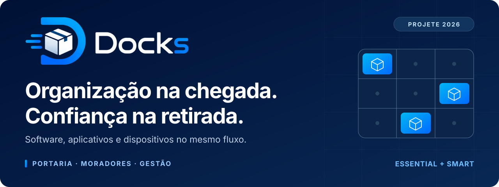
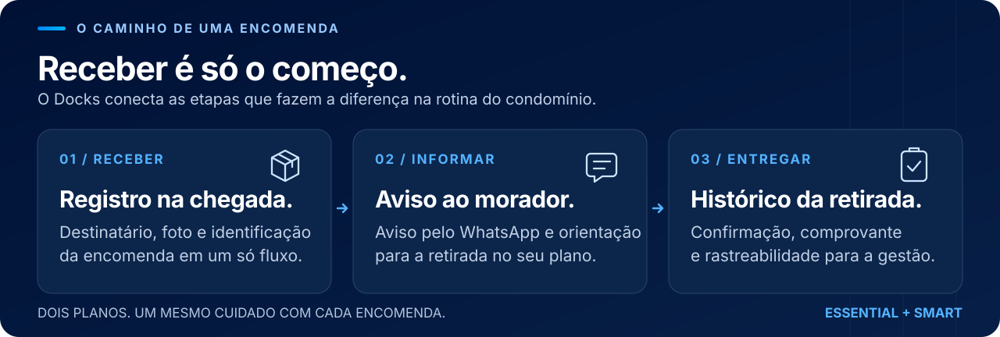
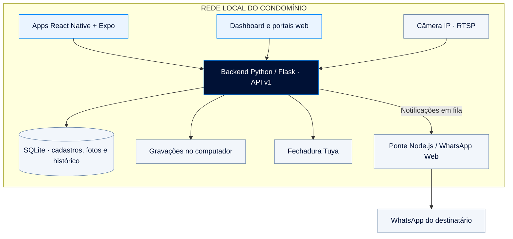

<p align="center">
  
</p>

<p align="center">
  Gestão e rastreabilidade de encomendas para condomínios.<br>
  Um projeto do <strong>Grupo 3404</strong>, desenvolvido para o <strong>PROJETE 2026</strong>.
</p>

<p align="center">
  
  
  
  
</p>

<p align="center">
  <a href="#projeto">Conheça o Docks</a> ·
  <a href="#planos">Compare os planos</a> ·
  <a href="#arquitetura">Entenda a arquitetura</a> ·
  <a href="#instalacao">Coloque para funcionar</a> ·
  <a href="#documentacao">Explore o código</a>
</p>

---

<a id="projeto"></a>

## Uma encomenda não é só uma caixa

Quando uma entrega chega ao condomínio, começa uma sequência de perguntas: **para quem é, onde ficou, quem foi avisado e como comprovar a retirada?** Com vários moradores e muitas entregas, depender de anotações e recados torna essa rotina difícil de acompanhar.

O **Docks** conecta essas etapas. A portaria registra a chegada, o morador recebe a orientação para retirar e a administração acompanha o histórico. No plano **Essential**, a entrega continua com o porteiro. No **Smart**, aplicativos, sala de encomendas, câmera e fechadura trabalham juntos para organizar a retirada.



### As perguntas que o Docks ajuda a responder

| Pergunta da rotina                    | Resposta na plataforma                                                                               |
| ------------------------------------- | ---------------------------------------------------------------------------------------------------- |
| **“Chegou alguma coisa para mim?”**   | Aviso pelo WhatsApp; no Smart, consulta das encomendas no App do Morador.                            |
| **“Onde guardaram minha encomenda?”** | No Smart, posição de armazenamento informada no cadastro e exibida no mapa da sala.                  |
| **“Quem confirmou a retirada?”**      | Histórico da entrega presencial no Essential ou sessão de retirada confirmada no validador do Smart. |
| **“Como conferir o que aconteceu?”**  | Fotos, horários, logs, comprovantes e relatórios; no Smart, gravação vinculada à retirada.           |
| **“E se eu precisar de ajuda?”**      | WhatsApp da portaria no Essential; chat por apartamento no Smart.                                    |

<a id="planos"></a>

## Dois planos, a mesma rastreabilidade

**Essential** organiza a portaria que entrega pessoalmente. **Smart** acrescenta uma sala de encomendas conectada. O condomínio usa o mesmo dashboard e o mesmo aplicativo do porteiro, com os recursos apresentados conforme seu plano.

| Recurso                               | Docks Essential                                    | Docks Smart                                                   |
| ------------------------------------- | -------------------------------------------------- | ------------------------------------------------------------- |
| **Cadastro de moradores e porteiros** | Pelo dashboard do condomínio                       | Pelo dashboard do condomínio                                  |
| **Recebimento**                       | Destinatário e foto, sem informar tamanho          | Destinatário, tamanho, posição e foto                         |
| **Identificação da etiqueta**         | OCR com conferência do porteiro                    | OCR com conferência do porteiro                               |
| **Aviso de chegada**                  | WhatsApp                                           | WhatsApp e consulta pelo app                                  |
| **Retirada**                          | Entrega presencial feita pelo porteiro             | Acesso à sala por _QR Code_ e confirmação no validador        |
| **Código de confirmação**             | Quatro dígitos opcionais, enviados na chegada      | _QR Code_ temporário, vinculado ao condomínio e de uso único  |
| **Entrega a terceiros**               | Nome e vínculo do recebedor registrados            | Fluxo de retirada pelo morador no validador                   |
| **Contato com a portaria**            | WhatsApp informado pelo condomínio                 | Chat compartilhado pelos moradores do apartamento             |
| **Sala e compartimentos**             | Não exige sala ou validador                        | Mapa, ocupação por tamanho e alerta de capacidade             |
| **Câmera e fechadura**                | Não exige os equipamentos do Smart                 | Monitoramento, gravação e acionamento local da fechadura Tuya |
| **Gestão e auditoria**                | Encomendas, comprovantes, ocorrências, logs e PDFs | Esses recursos mais a gestão da sala e das gravações          |
| **Aplicativos utilizados**            | Porteiro                                           | Porteiro, morador e validador                                 |

O plano é selecionado no **Painel Admin**. A v10 não integra pagamentos. Moradores são cadastrados manualmente nos dois planos; a importação por CSV está desativada.

<a id="fluxos"></a>

## Da chegada ao comprovante

<details open>
<summary><strong>Smart — uma encomenda chega para o apartamento 202</strong></summary>

1. **Identificar.** O porteiro fotografa a etiqueta. O OCR sugere o destinatário, e o porteiro confere os dados.
2. **Guardar.** Após informar o tamanho, o sistema indica uma posição disponível. O porteiro armazena a encomenda e fotografa o pacote no local.
3. **Avisar.** O registro fica no servidor e a notificação segue para o WhatsApp. O morador consulta a encomenda no aplicativo.
4. **Autorizar.** O morador gera um _QR Code_. O validador verifica o condomínio e a validade, consome o código e aciona a fechadura.
5. **Confirmar.** O morador retira a encomenda e confirma no validador. A administração consulta o comprovante e a gravação associada.

A confirmação é uma ação no validador; o projeto não utiliza um sensor para provar que o pacote foi fisicamente removido.

</details>

<details>
<summary><strong>Essential — a mesma organização, com entrega na portaria</strong></summary>

1. O porteiro seleciona o morador e registra a foto da encomenda.
2. O morador recebe o aviso para procurar a portaria.
3. Se o condomínio ativou a confirmação por código, os quatro dígitos são gerados na chegada e enviados no mesmo aviso.
4. Na entrega, o porteiro informa quem recebeu e seu vínculo com o morador, confere o código quando exigido e confirma a retirada.
5. O dashboard conserva a entrega e seu comprovante.

Cinco erros bloqueiam a confirmação por código. Uma entrega por exceção exige autorização do síndico com justificativa e continua dependendo da confirmação do porteiro.

</details>

## Cada pessoa encontra o que precisa

| Interface           | Quem usa                        | O que resolve                                                                           |
| ------------------- | ------------------------------- | --------------------------------------------------------------------------------------- |
| **App do Porteiro** | Equipe da portaria              | Identificação, cadastro, fotografia e fluxo de entrega do plano; chat no Smart.         |
| **App do Morador**  | Moradores do Smart              | Primeiro acesso, encomendas, fotos, geração de _QR Code_ e conversa com a portaria.     |
| **App Validador**   | Tablet da sala Smart            | Leitura do _QR Code_ por câmera, liberação da sala e confirmação da retirada.           |
| **Dashboard**       | Síndico ou responsável          | Visão geral, moradores, porteiros, encomendas, ocorrências, relatórios e configurações. |
| **Painel Admin**    | Administração Docks             | Condomínios, planos, ativação, pesquisa e acompanhamento de contatos comerciais.        |
| **Landings**        | Pessoas interessadas no projeto | Problema, solução, funcionamento, segurança, planos e formulário “Fale conosco”.        |

### Recursos que fazem diferença no uso diário

- **Cadastros ligados ao condomínio.** Moradores têm ID próprio, mesmo quando compartilham um apartamento. Porteiros usam credenciais criadas pelo síndico.
- **Primeiro acesso orientado.** As credenciais iniciais do condomínio e dos moradores Smart são enviadas pelo WhatsApp. A troca de senha faz parte do primeiro acesso; o síndico não recebe a senha do morador na tela.
- **Cadastro protegido contra repetição.** O recibo da operação evita duplicar uma encomenda quando o aplicativo repete a mesma solicitação após perder a resposta da rede.
- **Armazenamento visível.** O Smart apresenta posições agrupadas por tamanho, capacidade ocupada e encomendas que já ultrapassaram o prazo de alerta.
- **Conversas por apartamento.** O chat Smart atualiza automaticamente e mantém as mensagens por 14 dias. Todos os moradores ativos do apartamento compartilham a conversa.
- **Auditoria consultável.** PDFs de logs, encomendas, moradores, retiradas, ocorrências e falhas técnicas identificam o condomínio e seu plano.
- **Gravações com contexto.** No Smart, a marca d'água informa data, hora, condomínio e retirada. O painel permite navegar pelo vídeo, alterar a velocidade e consultar a previsão de exclusão.
- **Ocorrências acompanhadas.** É possível registrar e resolver ocorrências. Uma gravação preservada não volta à exclusão automática apenas porque a ocorrência foi resolvida.
- **Interfaces adaptadas ao aparelho.** Morador e porteiro priorizam o celular; o validador, o tablet. Há ajustes de tamanho de letra e temas claro/escuro nas interfaces correspondentes; o validador mantém o tema escuro.

<a id="arquitetura"></a>

## Uma operação local, com serviços conectados

O computador do condomínio concentra as regras e os dados. Aplicativos e páginas web usam o mesmo backend, e a internet externa entra principalmente na comunicação com o WhatsApp.



A câmera, a fechadura e o validador compõem o fluxo **Smart**. O **Essential** utiliza o mesmo servidor, sem exigir esses equipamentos.

### Tecnologias com uma função definida

| Camada                   | Tecnologias                                                             | Papel no Docks                                                          |
| ------------------------ | ----------------------------------------------------------------------- | ----------------------------------------------------------------------- |
| **Servidor e API**       | Python, Flask, Flask-Cors e Werkzeug                                    | Autenticação, validações, regras e comunicação entre interfaces.        |
| **Persistência**         | SQLite e Flask-SQLAlchemy                                               | Cadastros, encomendas, fotos, conversas, auditoria e tarefas pendentes. |
| **Aplicativos**          | React Native **0.86.3**, React **19.2.3**, Expo **SDK 57** e TypeScript | Uso em celulares e tablets, câmera e armazenamento de sessão.           |
| **Web**                  | HTML, CSS, JavaScript e recursos locais de interface                    | Landings, administração, dashboard e portais web.                       |
| **Leitura de etiquetas** | EasyOCR e NumPy                                                         | Sugestão de destinatário a partir da imagem, com conferência humana.    |
| **Câmera e vídeo**       | OpenCV e RTSP                                                           | Transmissão local, gravação e reprodução pelo dashboard.                |
| **Fechadura**            | TinyTuya                                                                | Comunicação e acionamento do módulo pela rede local.                    |
| **Notificações**         | Node.js, Express e whatsapp-web.js                                      | Ponte com o WhatsApp Web e envio das mensagens do sistema.              |

O dashboard e os portais operacionais usam bibliotecas e fontes locais de [`frontend/vendor/`](Software/v10/frontend/vendor). As landings também carregam fontes pelo Google Fonts.

### O que “sem internet” significa aqui

| Situação                                              | Comportamento esperado                                                                                         |
| ----------------------------------------------------- | -------------------------------------------------------------------------------------------------------------- |
| **Internet externa caiu, mas a rede local funciona**  | Cadastros, consultas, chat Smart e fluxo de retirada continuam usando o servidor e os dispositivos acessíveis. |
| **WhatsApp ou ponte indisponível**                    | Notificações persistentes aguardam nova tentativa. Mensagens de recuperação vencidas não são enviadas.         |
| **Internet e WhatsApp voltaram**                      | A fila retoma os envios pendentes.                                                                             |
| **Servidor desligado ou aparelho fora da rede local** | O fluxo precisa recuperar a conexão com o PC. Os apps não mantêm uma cópia completa do banco no celular.       |
| **Servidor reiniciado**                               | Há recuperação de tarefas e registros interrompidos; sessões em memória exigem novo login.                     |

A instalação inicial, os modelos de OCR e os testes no Expo Go devem ser preparados antes da demonstração. O [EasyOCR baixa os modelos de idioma no primeiro uso](https://github.com/JaidedAI/EasyOCR#usage).

<a id="instalacao"></a>

## Coloque o Docks para funcionar

Os comandos abaixo são para **PowerShell no Windows**. Cada terminal permanece aberto enquanto seu componente estiver em uso. Execute somente o ponto de entrada Python; os módulos de `backend/` são carregados por ele.

### 1. Prepare o computador e a rede

| Necessário                   | Preparação                                                                                                                                             |
| ---------------------------- | ------------------------------------------------------------------------------------------------------------------------------------------------------ |
| **Git**                      | Para obter o repositório.                                                                                                                              |
| **Python 3 e pip**           | Para instalar [`requirements.txt`](Software/v10/requirements.txt). O arquivo atual não fixa uma versão mínima de Python ou as versões das bibliotecas. |
| **Node.js e npm**            | Use uma versão compatível com os apps. A linha **24, a partir da 24.3**, atende ao requisito registrado no lockfile.                                   |
| **Chrome, Edge ou Chromium** | Navegador instalado para a ponte do WhatsApp.                                                                                                          |
| **Rede local**               | PC e aparelhos conectados entre si, sem isolamento de clientes.                                                                                        |
| **Expo Go**                  | Versão compatível com **SDK 57** para os testes móveis.                                                                                                |

Para testar o **Smart completo**, conecte também a câmera IP, o módulo Tuya/fechadura e o tablet validador. No **Essential**, basta preparar o PC, o aplicativo do porteiro e o WhatsApp.

```powershell
git clone https://github.com/YanGabardo/3404_Docks.git
cd .\3404_Docks

python --version
node --version
npm --version
```

Se o repositório já foi baixado, abra o terminal na sua pasta raiz.

Antes de iniciar o servidor, o responsável pela instalação define localmente `ADMIN_USUARIO` e `ADMIN_SENHA` em [`backend/app.py`](Software/v10/backend/app.py). Essas credenciais dão acesso ao Painel Admin, em `/admin`.

### 2. Inicie o servidor — terminal 1

```powershell
cd "Software/v10"
python -m pip install -r requirements.txt
python .\app-v10.py
```

Abra **[http://127.0.0.1:5000](http://127.0.0.1:5000)** no PC. O servidor atende na porta **5000**.

<details>
<summary><strong>Endereços das páginas e verificação do servidor</strong></summary>

| Página                  | Caminho          |
| ----------------------- | ---------------- |
| Início                  | `/`              |
| Solução                 | `/solucao`       |
| Como funciona           | `/funcionamento` |
| Segurança               | `/seguranca`     |
| Para condomínios        | `/comercial`     |
| Fale conosco            | `/contato`       |
| Painel Admin            | `/admin`         |
| Dashboard do condomínio | `/dashboard`     |
| Portal do Porteiro      | `/porteiro`      |
| Portal do Morador       | `/morador`       |
| Validador web           | `/validador`     |

Para confirmar que o backend responde:

```powershell
Invoke-RestMethod http://127.0.0.1:5000/api/health
```

Esse endereço verifica o backend. A prontidão real do WhatsApp deve ser conferida na ponte, conforme o próximo passo.

</details>

### 3. Inicie o WhatsApp — terminal 2

Abra outro terminal na raiz do repositório:

```powershell
cd "Software/v10/integrations/whatsapp"
npm ci
npm start
```

A ponte tenta localizar automaticamente Chrome, Edge ou Chromium. Quando aparecer o código de vinculação, abra **WhatsApp → Aparelhos conectados → Conectar aparelho** e escaneie. Aguarde a indicação de que o cliente está pronto.

Para verificar o estado em outro terminal:

```powershell
Invoke-RestMethod http://127.0.0.1:3000/status
```

A ponte responde **200 quando pronta** e **503 enquanto indisponível**. Ela utiliza WhatsApp Web; não é uma integração com a API oficial da Meta.

### 4. Prepare o condomínio

1. Entre no **Painel Admin**, em `/admin`, com o acesso definido na instalação.
2. Crie o condomínio, informe o responsável e selecione **Essential** ou **Smart**.
3. O responsável recebe as credenciais iniciais pelo WhatsApp, acessa a **Área do Cliente** e troca a senha.
4. No dashboard, cadastre os **moradores** e os **porteiros**.
5. No **Smart**, confira a URL RTSP da câmera, os dados do Tuya, posições/capacidade, validade do _QR Code_, gravação e retenção.
6. No **Essential**, defina se a entrega exige o código de quatro dígitos e ajuste o prazo de alerta.
7. Use o botão **Salvar configurações** no topo do painel.

As mensagens do WhatsApp são definidas pelo sistema e não são editadas pelo síndico nas configurações.

<a id="mobile"></a>

### 5. Abra os três aplicativos simultaneamente

Use um terminal por aplicativo, começando sempre na raiz do repositório. No Essential, é necessário somente o porteiro.

**Terminal 3 · Morador**

```powershell
cd "Software/v10/mobile/apps/morador"
npm ci
npx expo login
npx expo start --lan --port 8081
```

**Terminal 4 · Porteiro**

```powershell
cd "Software/v10/mobile/apps/porteiro"
npm ci
npx expo start --lan --port 8082
```

**Terminal 5 · Validador**

```powershell
cd "Software/v10/mobile/apps/validador"
npm ci
npx expo start --lan --port 8083
```

O login Expo pode ser feito uma vez no computador. Use a mesma conta no Expo Go se ela for solicitada durante os testes.

| Aplicativo    | Plataforma declarada          | Porta escolhida para o teste |
| ------------- | ----------------------------- | ---------------------------- |
| **Morador**   | Android                       | 8081                         |
| **Porteiro**  | Android                       | 8082                         |
| **Validador** | Android e iOS, incluindo iPad | 8083                         |

Escaneie o código do terminal correspondente com o Expo Go. No iPhone/iPad, ele pode ser aberto pela câmera do aparelho. No aplicativo Docks, informe o endereço do **backend**, por exemplo `http://192.168.0.106:5000`, e conceda as permissões de câmera quando pedidas.

Use `ipconfig` no PC para descobrir o IPv4. O endereço `localhost` no celular aponta para o próprio aparelho. As portas **8081–8083** entregam o app; a **5000** atende às operações do Docks.

No primeiro acesso do morador **Smart**, use as credenciais recebidas pelo WhatsApp, troque a senha provisória e aceite os termos antes de gerar um _QR Code_.

<details>
<summary><strong>Gerar aplicativos instaláveis e distinguir build de exportação</strong></summary>

Em cada aplicativo **morador** ou **porteiro**:

```powershell
npm run build:inspect
npm run build:apk
```

No **validador**:

```powershell
npm run build:inspect
npm run build:android
npm run build:ios
```

Os scripts usam **EAS Build na nuvem** e limitam o projeto enviado à pasta do aplicativo. O perfil `preview` gera APK no Android. Confira o arquivo inspecionado antes de enviar o build e siga a configuração da conta Expo solicitada pelo EAS.

`npm run export:android` nos apps Android e `npm run export:apps` no validador exportam JavaScript e recursos; não produzem um aplicativo instalável assinado.

**Testar no Expo Go em um iPad não exige assinatura de distribuição Apple.** Um build iOS independente para aparelho físico exige o fluxo de assinatura e provisionamento da Apple descrito na [documentação do Expo](https://docs.expo.dev/build/setup/).

</details>

<a id="teste"></a>

## Uma demonstração que percorre o fluxo inteiro

Antes de começar, deixe o condomínio, os moradores e o porteiro cadastrados. Confira o plano, a ponte WhatsApp pronta, o endereço do PC nos apps e, no Smart, a câmera e a fechadura.

| Etapa                         | Essential                                                    | Smart                                                                   |
| ----------------------------- | ------------------------------------------------------------ | ----------------------------------------------------------------------- |
| **1 · Receber**               | Registre destinatário e foto.                                | Leia a etiqueta, confira os dados, informe tamanho, guarde e fotografe. |
| **2 · Avisar**                | Confira o aviso no WhatsApp e o código, se ativado.          | Confira o aviso e a encomenda no App do Morador.                        |
| **3 · Retirar**               | Registre o recebedor, confira o código e confirme a entrega. | Gere o _QR Code_, leia no validador e confirme a retirada.              |
| **4 · Conferir**              | Consulte o comprovante e os logs.                            | Consulte comprovante, logs e reprodução integral do vídeo.              |
| **5 · Evidenciar o controle** | Teste código incorreto e a autorização de exceção.           | Tente reutilizar o código e validá-lo em outro condomínio.              |

Para testar a operação sem internet, desligue **somente o acesso externo**, mantendo PC, roteador, aplicativos e equipamentos comunicáveis. Depois, restaure a internet e confira os envios pendentes.

<details>
<summary><strong>Testes automatizados disponíveis no repositório</strong></summary>

No diretório `Software/v10`, após instalar as dependências:

```powershell
python -m unittest discover -s tests -p "test_*.py"
node --test tests/recording-player.test.cjs
```

Em **cada** pasta de `Software/v10/mobile/apps/`:

```powershell
npm run check
npm test
```

Na pasta `Software/v10/integrations/whatsapp`:

```powershell
npm test
```

As suítes verificam contratos e regras de moradores, portaria, planos, validador, chat, configurações e vídeo, além de comportamentos dos clientes móveis e descoberta de navegador. Parte dos testes utiliza banco temporário, hardware simulado e vídeo sintético. A validação com câmera, fechadura e WhatsApp reais completa a verificação.

</details>

<details>
<summary><strong>Se algo não abrir: verificações por sintoma</strong></summary>

| Sintoma                                       | O que conferir                                                                                                     |
| --------------------------------------------- | ------------------------------------------------------------------------------------------------------------------ |
| Celular não alcança o servidor                | IPv4 atual do PC, mesma rede, isolamento de clientes e firewall na porta 5000.                                     |
| Expo abre um app diferente ou não conecta     | Código do terminal correto, portas 8081/8082/8083, versão do Expo Go e acesso à rede local.                        |
| `Cannot find module whatsapp-web.js`          | Execute `npm ci` dentro de `Software/v10/integrations/whatsapp`.                                                   |
| WhatsApp permanece iniciando                  | Confira `/status`, navegador instalado e mensagens do terminal da ponte.                                           |
| Dashboard sem imagem da câmera                | Salve a URL RTSP correta, confira credenciais da câmera e teste sua conexão a partir do PC.                        |
| OCR lento no primeiro uso                     | Prepare os modelos com internet e faça uma leitura antes da apresentação; confira foco e iluminação da etiqueta.   |
| Roteador usa WDS com hotspot e perde internet | Verifique se a associação está ativa e se o canal corresponde ao hotspot. O canal pode mudar ao religar o celular. |
| Um novo PC não encontra os dados antigos      | O Git fornece os códigos. Banco, vídeos, credenciais e sessões pertencem à instalação local.                       |
| Login deixa de funcionar após reiniciar       | Entre novamente: sessões do servidor ficam em memória.                                                             |

Instale as dependências de cada componente na sua própria pasta. A pasta `mobile/apps/` não substitui as instalações de `morador/`, `porteiro/` e `validador/`.

</details>

<a id="documentacao"></a>

## Explore o projeto por dentro

```text
3404_Docks/
├── README.md
├── LICENSE
├── .gitignore
├── Documentos/                         Materiais de apoio e apresentação
└── Software/
    ├── v10/                            Software atual
    │   ├── app-v10.py                  Entrada única do servidor
    │   ├── requirements.txt            Dependências Python
    │   ├── backend/                    Regras, API, banco e integrações
    │   ├── frontend/
    │   │   ├── landings/               Apresentação e contato
    │   │   ├── dashboard/              Dashboard e Painel Admin
    │   │   ├── apps/                   Portais web dos três perfis
    │   │   ├── shared/                 Validação e acessibilidade
    │   │   ├── assets/                 Identidade visual e player
    │   │   └── vendor/                 Bibliotecas e fontes locais
    │   ├── mobile/apps/
    │   │   ├── morador/                App Android do Smart
    │   │   ├── porteiro/               App Android dos dois planos
    │   │   └── validador/              App Android/iOS do Smart
    │   ├── integrations/whatsapp/      Ponte Node.js
    │   ├── docs/                      Contratos e notas técnicas
    │   └── tests/                     Suítes de verificação
    ├── v9/                            Versão web anterior
    ├── v1/ … v8/                      Histórico de desenvolvimento
    └── Testes Isolados/                Experimentos de cada integração
```

### Onde consultar cada parte

| Quero entender…                                        | Arquivo ou pasta                                                                     |
| ------------------------------------------------------ | ------------------------------------------------------------------------------------ |
| **API do morador**                                     | [Contrato e rotas](Software/v10/docs/API-MORADOR.md)                                 |
| **API do porteiro e diferenças entre planos**          | [Contrato e rotas](Software/v10/docs/API-PORTEIRO.md)                                |
| **Validação, confirmação e recuperação de tentativas** | [API do Validador](Software/v10/docs/API-VALIDADOR.md)                               |
| **Decisões de interface e vídeo**                      | [Revisão visual e de vídeo](Software/v10/docs/REVISAO-VISUAL-E-VIDEO.md)             |
| **Regras e persistência**                              | [Backend](Software/v10/backend) · [Modelos do banco](Software/v10/backend/models.py) |
| **Fila e funcionamento sem internet externa**          | [Serviço offline](Software/v10/backend/offline.py)                                   |
| **Experimentos independentes**                         | [Testes Isolados](Software/Testes%20Isolados)                                        |

As rotas móveis usam **`/api/v1/`**. As rotas **`/api/...`** continuam atendendo os clientes web. Respostas JSON versionadas usam `success`, `message`, `data` e `code`; fotos, vídeos e documentos preservam seu formato de arquivo.

### Código do projeto e dados da instalação

| Conteúdo                            | Local padrão na v10                       |
| ----------------------------------- | ----------------------------------------- |
| Banco SQLite                        | `data/docks.db`                           |
| Fotos das encomendas                | Dentro do banco, no registro da encomenda |
| Vídeos das retiradas                | `storage/gravacoes/`                      |
| Sessão do WhatsApp                  | `integrations/whatsapp/.wwebjs_auth/`     |
| Endereço do servidor e sessão móvel | Armazenamento local de cada aplicativo    |

O banco e as pastas de execução são preparados pelo servidor. Ao mover a instalação para outro PC, configure os equipamentos e as contas locais; leve os dados existentes separadamente se quiser preservar o histórico.

### Acesso, privacidade e limites da v10

Senhas de usuários são armazenadas como hash. O backend verifica perfil, condomínio e plano. No Smart, o _QR Code_ é consumido na validação e não pode ser reutilizado. Se a resposta se perder, o validador recupera o resultado da mesma solicitação sem repetir o pulso. Um resultado incerto exige conferir a porta com a administração.

Fotos, conversas e gravações exigem cuidado no armazenamento e no compartilhamento. O chat tem retenção de **14 dias**; a retenção das gravações é configurável e pode ser suspensa para preservar uma ocorrência.

A execução documentada utiliza **HTTP e o servidor de desenvolvimento Flask em rede local controlada**. Colocar a instalação em produção ou expô-la à internet exige preparar hospedagem, HTTPS, controles de acesso e operação apropriados.

Antes de publicar os códigos, confira credenciais embutidas, chaves Tuya e URLs de câmera que incluam usuário ou senha. O [`.gitignore`](.gitignore) trata arquivos de execução; ele não remove segredos escritos dentro dos códigos.

<a id="equipe"></a>

## Feito pelo Grupo 3404

O Docks foi desenvolvido para o **PROJETE 2026**, reunindo desenvolvimento web e mobile, banco de dados, visão computacional, comunicação em rede e integração com dispositivos físicos em um problema real da rotina de condomínios.

| Integrantes                    |
| ------------------------------ |
| **Caio Augusto Faria Machado** |
| **Iury Gonçalves de Souza**    |
| **Tuany Silva Pereira**        |
| **Yan Gabardo Souza**          |

### Licença

**Copyright © 2026 Equipe Docks. Todos os direitos reservados.**

O software e seu código-fonte pertencem aos autores. Cópia, modificação, distribuição, sublicenciamento ou utilização comercial, total ou parcial, dependem de autorização expressa, conforme a [licença proprietária](LICENSE). Componentes de terceiros mantêm suas respectivas licenças.

---

<p align="center">
  <strong>Docks · Grupo 3404 · PROJETE 2026</strong><br>
  Tecnologia para organizar o que chega e registrar o que sai.
</p>
